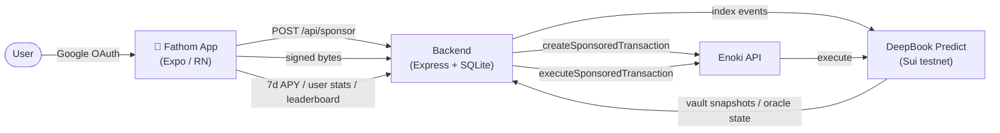

# Fathom

> Swipe to bet on Sui — a mobile-first prediction market that composes **DeepBook Spot + DeepBook Predict** in a single sponsored transaction.

Fathom turns binary and range prediction markets into a swipe-deck. There are no wallet pop-ups, no gas approvals, and no seed phrases. Sign in with Google, swipe right for YES, left for NO, and claim winnings with one tap. The same DeepBook Predict vault that pays out winners is open to **anyone** as an LP via the Earn tab — making Fathom a self-contained dual-sided economy on a single shared pool.

**Sui Overflow 2026 / DeepBook track headline:** DeepBook's orderbook is *load-bearing and on-chain-enforced*, not decorative:

1. **Enforced atomic spot leg.** Flip on **Smart Bet** and each swipe submits one sponsored PTB that mints a Predict position **and** trades SUI on `deepbook::pool::swap_exact_base_for_quote<SUI, DBUSDC>` — then calls **Fathom's own Move package** `fathom_router::assert_and_record`, which *asserts the orderbook actually filled* a real slippage floor (aborting the whole transaction otherwise) and emits a `HedgedSwapExecuted` event. No fill, no bet — atomically.
2. **Real maker liquidity.** A maker-order panel rests genuine limit orders on the SUI/DBUSDC CLOB via a per-user `BalanceManager` (`place_limit_order` / `cancel_order`), sponsored end-to-end.
3. **Live orderbook data.** A backend feed surfaces the live SUI/DBUSDC mid + spread in-app.

Honest about testnet: the spot leg only engages when the book can fill and the wallet holds DEEP; otherwise the swipe mints a plain Predict position and says why. Predict lists only BTC markets on testnet, so we do **not** pretend to price them off DeepBook.

## For judges

- **60-second demo video:** _(record per [`docs/demo-script.md`](docs/demo-script.md) and link here)_
- **Try it in 10 seconds:** install the [release APK](docs/build-android.md) on Android, or run `EXPO_PUBLIC_DEMO_MODE=true npm run start` for a deterministic walkthrough.
- **What to look at, in order:**
  1. **Swipe tab** — toggle **DeepBook Smart Bet** on (the chip directly above the deck). Each swipe now bundles a Predict mint + DeepBook Spot hedge in one explorer digest.
  2. **Profile / Settings tab** — claim winnings to see the itemized **Gross → Fathom fee → Net** modal (1% take-rate skimmed inside the redeem PTB), and try the **DeepBook swap** utility panel for standalone SUI ↔ DBUSDC.
  3. **Earn tab** — deposit dUSDC into DeepBook Predict's shared vault for PLP shares and a live 7-day APY, with on-chain `available_withdrawal` pre-check before every withdraw.

## Why it matters

- **Enforced DeepBook composability in one digest.** Smart Bet builds a single sponsored PTB that calls `predict::mint`, `deepbook::pool::swap_exact_base_for_quote<SUI, DBUSDC>`, and Fathom's own `fathom_router::assert_and_record` — which enforces the orderbook filled a real floor (abort reverts the mint too) and emits a linking event. The previous version passed `min_out = 0` and silently no-op'd; this one is on-chain-asserted. The same SUI/DBUSDC orderbook also powers a standalone swap panel and a real maker-order (limit-order) panel in Profile.
- **No wallet friction.** zkLogin + Enoki sponsorship means a new user is signing on-chain transactions on Sui testnet within seconds of tapping "Continue with Google" — and the user keeps full self-custody of their ephemeral key.
- **Real on-chain trading.** Every swipe builds a sponsored PTB that calls `predict::mint` or `predict::mint_range` on the canonical [DeepBook Predict deployment](https://github.com/MystenLabs/deepbookv3/tree/predict-testnet-4-16/packages/predict). Solvency is enforced **on-chain** by `predict::max_total_exposure_pct`.
- **One shared liquidity pool.** Earn-tab LPs supply the same vault that pays Swipe-tab winners — a true dual-sided economy with no intermediary, no Fathom-owned Move package, and no keeper bot. The Earn withdraw flow surfaces Predict's on-chain `available_withdrawal` rate-limiter before submission.
- **Honest revenue.** Fathom skims a transparent 1% fee on the winning payout — split inside the same `predict::redeem` + `predict_manager::withdraw` PTB and routed straight to a treasury address. Net to the user is itemized in the claim modal: _we only earn when you win_.

## Architecture



- **App** (`app/`, `components/`, `hooks/`, `services/`, `store/`) — Expo Router + NativeWind + Zustand + TanStack Query. zkLogin signing happens **on device** via `EnokiKeypair`; the backend never sees the user's ephemeral key.
- **Backend** (`backend/`) — Enoki sponsorship relay (`/api/sponsor`, `/api/execute`), Google OAuth deep-link relay (`/auth/callback` → `/auth/relay`), event indexer over six Predict event filters, and a 5-minute Predict-vault snapshotter that derives a rolling 7-day APY.
- **Move layer** — one small Fathom package, [`move/fathom_router`](move/fathom_router) (`router::assert_and_record`), enforces the Smart Bet DeepBook spot fill on-chain and emits a linking event. Everything else targets DeepBook Predict + DeepBook v3's published modules directly.

## Stack

Expo Router · TypeScript (strict) · NativeWind · Reanimated · Deck Swiper · Zustand · TanStack Query · `@mysten/sui` · `@mysten/enoki` · `@mysten/deepbook-v3` · Node/Express · SQLite (`better-sqlite3`).

## Run it locally

Copy env files and install:

```bash
cp .env.example .env
cp backend/.env.example backend/.env
npm install
(cd backend && npm install)
```

Required app env (`.env`):

- `EXPO_PUBLIC_ENOKI_API_KEY`
- `EXPO_PUBLIC_GOOGLE_CLIENT_ID` and `EXPO_PUBLIC_GOOGLE_REDIRECT_URI`
- `EXPO_PUBLIC_BACKEND_URL`

Required backend env (`backend/.env`):

- `ENOKI_PRIVATE_KEY`
- `PORT` (default 3001)

Start the backend, then the app:

```bash
cd backend && npm run dev      # http://localhost:3001
# in another terminal
npm run start
```

To run the deterministic demo loop (no Predict-server / faucet / sponsorship dependencies):

```bash
EXPO_PUBLIC_DEMO_MODE=true npm run start
```

## Quality gates

```bash
npm run typecheck && npm run lint
(cd backend && npm run build && npm test)
```

All gates pass clean on `main`.

## Canonical on-chain identifiers (Sui testnet)

|                          |                                                                      |
| ------------------------ | -------------------------------------------------------------------- |
| Fathom router (ours)     | `0x92555862cc0dbcedfd6f7ff15bc5ebf42e5bc33e81bf87dac0e611bf45e1c89c` |
| Predict package          | `0xf5ea2b3749c65d6e56507cc35388719aadb28f9cab873696a2f8687f5c785138` |
| Predict shared object    | `0xc8736204d12f0a7277c86388a68bf8a194b0a14c5538ad13f22cbd8e2a38028a` |
| Predict registry         | `0x43af14fed5480c20ff77e2263d5f794c35b9fab7e2212903127062f4fe2a6e64` |
| dUSDC (Predict quote)    | `0xe95040…1a::dusdc::DUSDC`                                          |
| PLP share type           | `<predict_pkg>::plp::PLP`                                            |
| DeepBook v3 package      | `0x22be4cade64bf2d02412c7e8d0e8beea2f78828b948118d46735315409371a3c` |
| DeepBook SUI/DBUSDC pool | `0x1c19362ca52b8ffd7a33cee805a67d40f31e6ba303753fd3a4cfdfacea7163a5` |
| DBUSDC (DeepBook quote)  | `0xf7152c0…d7::DBUSDC::DBUSDC`                                       |

DeepBook Predict source: [`MystenLabs/deepbookv3` branch `predict-testnet-4-16`](https://github.com/MystenLabs/deepbookv3/tree/predict-testnet-4-16/packages/predict). DeepBook v3 testnet ids and pool addresses come from `@mysten/deepbook-v3`'s `testnetPackageIds` / `testnetPools` — pinned and verified by [`scripts/probe-deepbook.ts`](scripts/probe-deepbook.ts).

## Submission docs

- [`docs/demo-script.md`](docs/demo-script.md) — pre-recording checklist and tap-by-tap demo flow.
- [`docs/build-android.md`](docs/build-android.md) — release APK build + install.
- [`docs/marketing-prep.md`](docs/marketing-prep.md) — tagline, one-liner, pitch bullets.
- [`docs/range-markets.md`](docs/range-markets.md) — range-mode product spec.
- [`TECHNICAL_OVERVIEW.md`](TECHNICAL_OVERVIEW.md) — zkLogin flow, Enoki sponsorship, vault math, APY derivation.

## Notes

- Targets DeepBook v3 + DeepBook Predict **testnet**. Mainnet readiness is out of scope for this submission.
- Demo mode covers Welcome, Swipe, Settlement, Claim, and Earn end-to-end — safe to record video against even if Predict server / faucet / RPC are flaky. The Smart Bet spot leg, the maker-order panel, and the DeepBook swap utility require live testnet. Smart Bet engages its enforced spot leg only when the book can fill the size **and** the wallet holds DEEP for the fill fee; otherwise the swipe mints a plain Predict position and shows the reason (no silent no-op).
- Settlement alone does not auto-transfer funds; users explicitly tap "Claim winnings" on the Settings tab. The redeem PTB itemises Fathom's 1% take-rate before transferring net to the user.
- `dUSDC` (Predict's quote) and `DBUSDC` (DeepBook's quote) are distinct coin types on testnet with no on-chain wrapper. Smart Bet therefore composes Predict + DeepBook via an enforced spot leg rather than an atomic SUI → dUSDC onramp.
- On testnet, Predict lists **only BTC** oracles and DeepBook's only liquid book is **SUI/DBUSDC** (the DBTC book is empty). We therefore do **not** price the prediction markets off DeepBook — that would be dishonest — and surface a live DeepBook SUI/DBUSDC ticker instead. The DeepBook spot leg only fills for sizes ≥ ~1 SUI with DEEP held.
